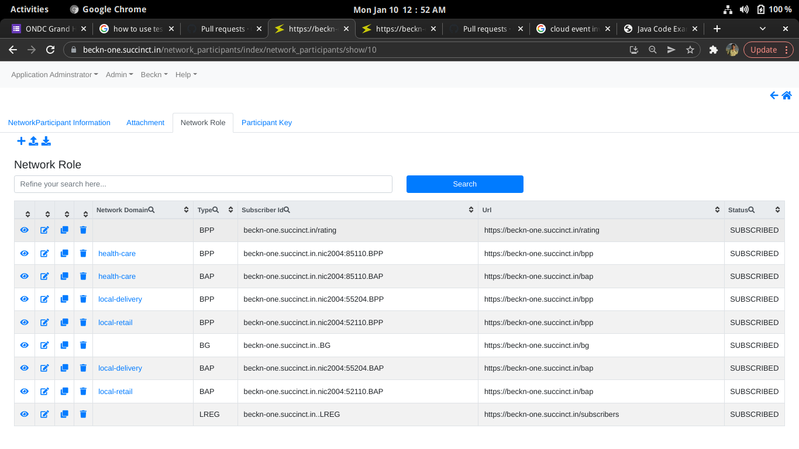
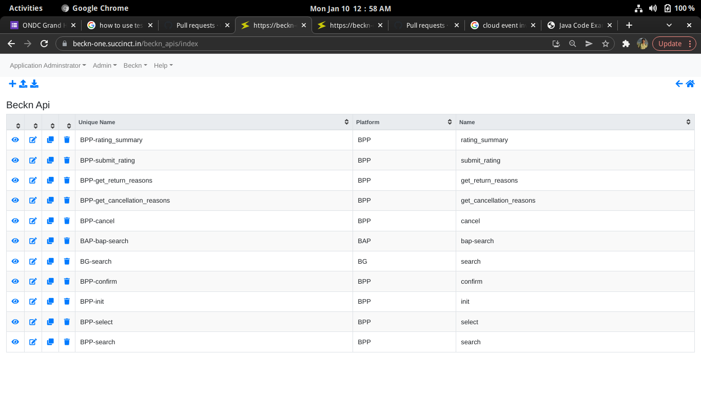
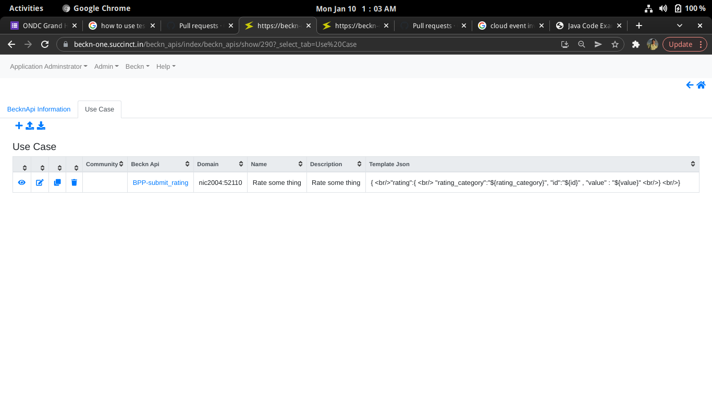
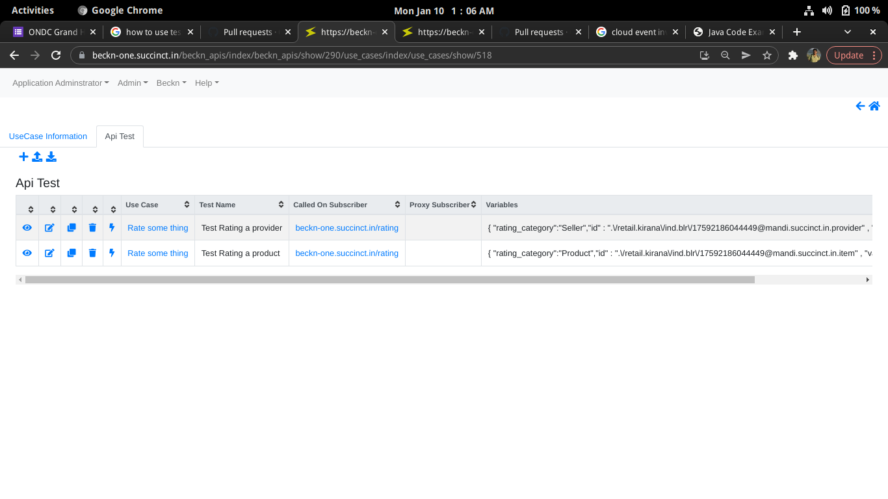
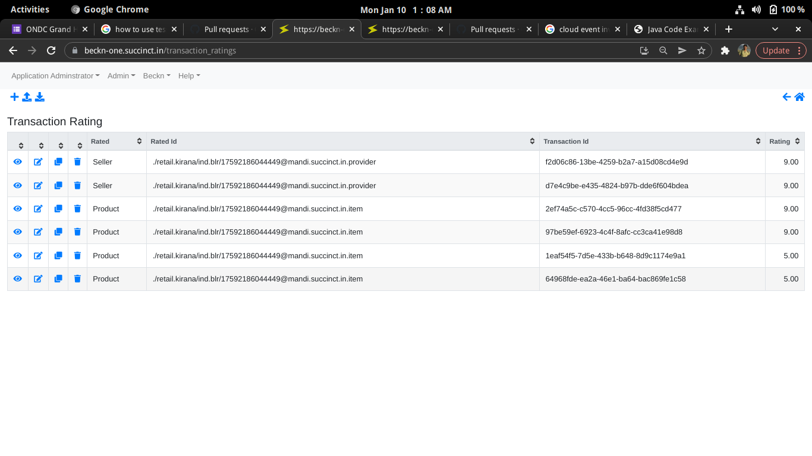
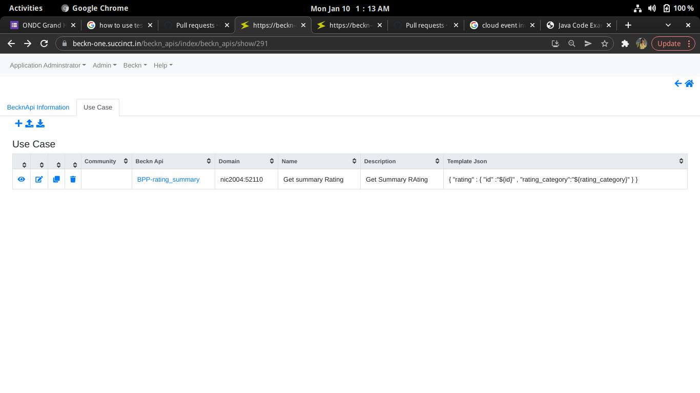
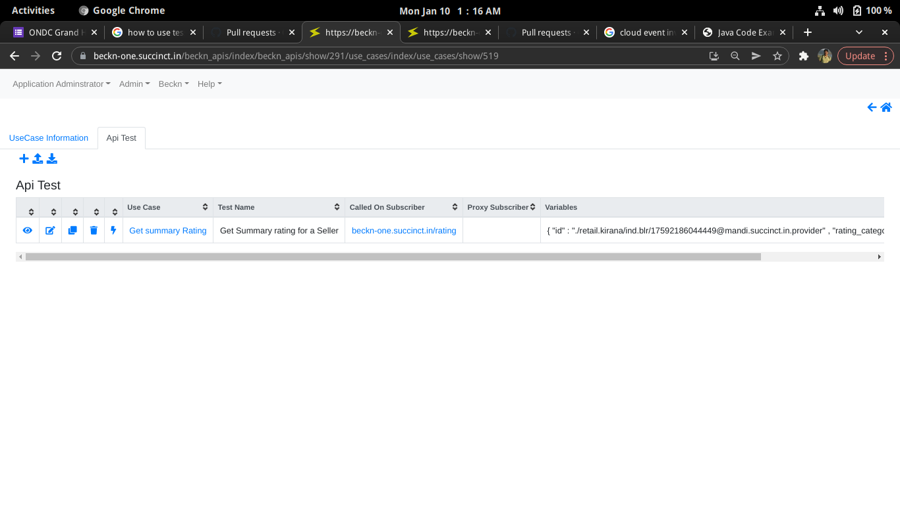
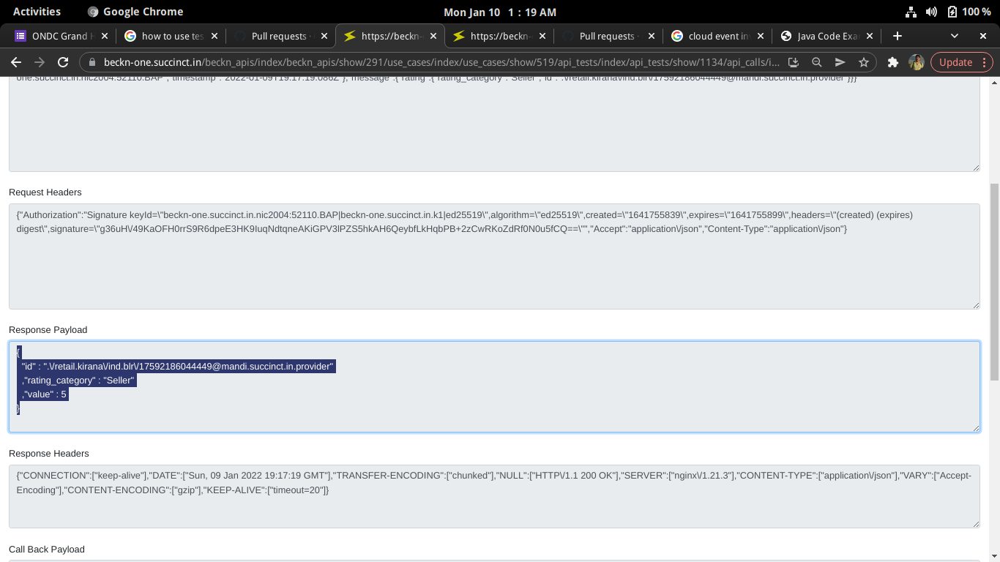

# Rating Framework for a beckn network
In a beckn network, there can be rating provider (a bpp) which a domain agnostic bpp. (like domain agnostic bg )

Any subscriber of any domain can may a call to these endpoints
## /submit_rating 
Input:
Standard Beckn Request with "rating" object. (of "Rating" schema)
Auth : 
Default Signature authorizion 

Response: 
ACK 

Callback:
NONE

### Summary
Will take the rating object and publish to a queue. 
Rating collation subscriber, takes the entry, 

Summarizes the information at the object id that is rated. 
It "can" also persists to a distributed ledger at this point. We could not complete this for the hackathon. 
All registries in the network will write to the ledger with thier private key signing.

## /rating_summary
Input:
Standard Beckn Request with "rating" object. (of "Rating" schema)
Auth : 
Default Signature authorizion 

Response: 
Rating (summary information) 

Callback:
NONE

### Summary 
Returns summarized information of the rated object. 

#### Supported Rating category
Buyer, Seller, Product. 

#### Beckn One Portal Used for completion
1. Defined a domain agnostic BPP for rating subscriber_id beckn-one.succinct.in/rating 

1. Defined new Beckn Apis submit_rating & rating_summary.

1. Defined Usecases (relevant json fragments in beckn messages) for submit_rating:
	
	* Define test cases for Product and Seller rating (To fill $ variables defined in the usecases above)
	
	* Fired these tests. 
	* Checked at /ratings and /transaction_ratings endpoints
	
	
1. Defined Usecases for rating_summary 
	
	* Defined test cases for getting summary rating (Product & Seller)
	
	* Fired these tests.
	* Got synchronous response with the summary rating. 
	* 
	
